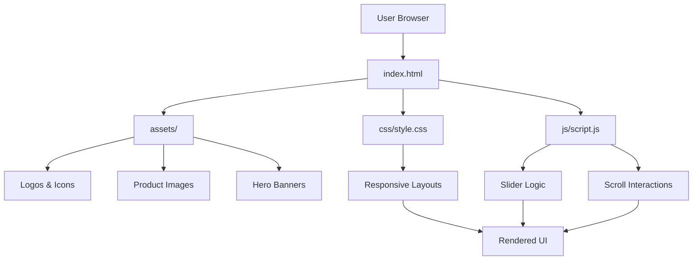
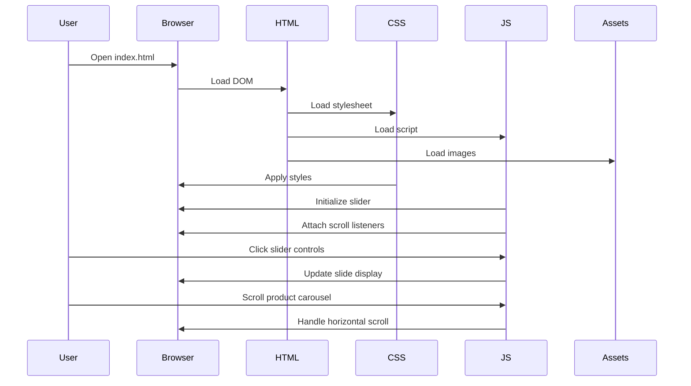
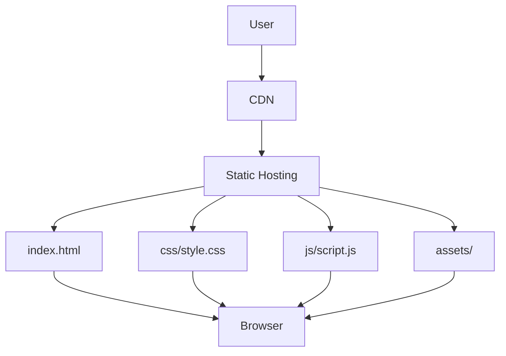

# Amazon Clone

> A responsive, static e-commerce UI clone inspired by Amazon's design, featuring product showcases, hero sliders, and mobile-first responsive layout.

---

## Table of Contents

- [Product Type](#product-type)
- [Tech Stack Badges](#tech-stack-badges)
- [Live URL](#live-url)
- [Overview](#overview)
- [Target Users](#target-users)
- [Problem Statement](#problem-statement)
- [Solution Summary](#solution-summary)
- [Key Features](#key-features)
- [Platform Modules](#platform-modules)
- [System Architecture](#system-architecture)
- [Technology Stack](#technology-stack)
- [Design System](#design-system)
- [UI/UX Guidelines](#uiux-guidelines)
- [Responsiveness & Breakpoints](#responsiveness--breakpoints)
- [Folder Structure](#folder-structure)
- [Environment Variables](#environment-variables)
- [Configuration Guide](#configuration-guide)
- [Local Setup](#local-setup)
- [Development Workflow](#development-workflow)
- [Build & Scripts](#build--scripts)
- [API Documentation](#api-documentation)
- [Database Schema](#database-schema)
- [Authentication Flow](#authentication-flow)
- [Authorization & Roles](#authorization--roles)
- [Security Practices](#security-practices)
- [Compliance & Data Privacy](#compliance--data-privacy)
- [Deployment Guide](#deployment-guide)
- [Hosting Architecture](#hosting-architecture)
- [CI/CD Pipeline](#cicd-pipeline)
- [Performance Optimization](#performance-optimization)
- [Monitoring & Logging](#monitoring--logging)
- [Error Handling Strategy](#error-handling-strategy)
- [Roadmap](#roadmap)
- [Changelog](#changelog)
- [Contribution Guidelines](#contribution-guidelines)
- [Code Standards](#code-standards)
- [License Details](#license-details)
- [Credits & Maintainers](#credits--maintainers)
- [Creator Social Links](#creator-social-links)
- [Think Pixel Social Links](#think-pixel-social-links)
- [Disclaimer](#disclaimer)
- [Contact & Support](#contact--support)
- [Branding Footer](#branding-footer)

---

## Product Type

**Static Website / Frontend UI Clone**

A browser-based, client-side only website with no backend dependencies, databases, or server-side processing.

---

## Tech Stack Badges


---

## Live URL

**🌐 https://amazone-clone.thinkpixel.org**

The live version of this project is hosted and powered by Think Pixel.

---

## Overview

Amazon Clone is a static frontend implementation that replicates the visual design and user interface of Amazon's e-commerce platform. The project demonstrates responsive web design principles, CSS grid/flexbox layouts, and vanilla JavaScript for interactive components. It serves as a reference implementation for e-commerce UI patterns and responsive design techniques.

The website features a hero image slider, product category sections, horizontal product carousels, promotional banners, and a comprehensive footer layout - all implemented using pure HTML, CSS, and JavaScript without any external frameworks or dependencies.

---

## Target Users

- **Frontend Developers**: Learning responsive design and CSS layout techniques
- **UI/UX Designers**: Reference for e-commerce interface patterns
- **Students**: Educational resource for HTML/CSS/JS implementation
- **Portfolio Builders**: Demonstration of static web development skills
- **Small Business Owners**: Starting point for simple e-commerce presence

---

## Problem Statement

Creating a responsive, visually appealing e-commerce interface from scratch requires understanding of complex CSS layouts, responsive design principles, and JavaScript interactivity. Many developers struggle with:

- Implementing responsive grid layouts that work across devices
- Creating smooth image sliders without external libraries
- Building horizontal scrollable product carousels
- Maintaining consistent design systems across components
- Optimizing for mobile-first user experiences

---

## Solution Summary

Amazon Clone provides a complete, working implementation of an e-commerce frontend using only native web technologies. The solution demonstrates:

- Pure CSS responsive design with media queries
- Vanilla JavaScript for slider and scroll interactions
- Semantic HTML5 markup for accessibility
- Mobile-first responsive breakpoints
- Amazon-inspired visual design patterns
- Optimized asset loading and display

---

## Key Features

### Implemented Features

- **Hero Image Slider**: Interactive carousel with navigation controls
- **Responsive Navigation**: Multi-level header with search, cart, and account sections
- **Product Category Grid**: 4-column responsive layout for category displays
- **Horizontal Product Carousels**: Scrollable product showcases with wheel-based navigation
- **Promotional Banners**: Dynamic offer sections with deal badges
- **Responsive Footer**: Multi-column footer with links and legal information
- **Mobile-First Design**: Optimized layouts for phones, tablets, and desktops
- **Google Fonts Integration**: Outfit font family for modern typography
- **Smooth Scrolling**: Horizontal scroll interactions for product sections

### UI Components

- Navigation bar with logo, location selector, search, language, account, and cart
- Secondary navigation with category menu and quick links
- Hero slider with 6 promotional images
- Category boxes with images and "Shop More" links
- Product sliders with image-only displays
- Product cards with pricing, discounts, and deal badges
- Comprehensive footer with 4-column layout

---

## Platform Modules

### Frontend Modules

1. **Header Module**
   - Logo and branding
   - Location/delivery selector
   - Search bar with category dropdown
   - Language selector
   - Account & lists dropdown
   - Returns & orders section
   - Shopping cart icon

2. **Navigation Module**
   - Category menu trigger
   - Quick navigation links (Today's Deals, Customer Service, etc.)

3. **Hero Slider Module**
   - Image carousel with 6 slides
   - Previous/Next navigation controls
   - Automatic slide management via JavaScript

4. **Category Display Module**
   - 12 category boxes across 3 rows
   - Image + title + "Shop More" link pattern
   - Responsive grid layout

5. ** Product Slider Module**
   - Horizontal scrollable product galleries
   - Wheel-based scroll interaction
   - Hidden scrollbars for clean UI

6. **Product Card Module**
   - Product image display
   - Discount badges
   - Pricing display (current + list price)
   - Product description

7. **Footer Module**
   - 4-column information layout
   - Brand logo and language selector
   - Affiliate links
   - Legal information and copyright

---

## System Architecture

### Architecture Overview

Amazon Clone follows a **static client-side architecture** with no server-side components. The application runs entirely in the browser with no backend dependencies.



### Data Flow



### Request Lifecycle

1. **Initial Load**: Browser requests `index.html`
2. **Resource Loading**: HTML triggers loading of CSS, JS, and image assets
3. **DOM Construction**: Browser builds DOM from HTML markup
4. **Style Application**: CSS rules are applied to DOM elements
5. **JavaScript Execution**: Slider initialization and event listeners attached
6. **User Interaction**: User interactions trigger JavaScript functions
7. **UI Updates**: JavaScript manipulates DOM for slider and scroll behavior

---

## Technology Stack

### Frontend

| Technology | Version | Purpose |
|------------|---------|---------|
| HTML5 | - | Semantic markup and document structure |
| CSS3 | - | Styling, layouts, and responsive design |
| JavaScript (ES6+) | - | Interactive functionality and DOM manipulation |
| Google Fonts | - | Outfit font family for typography |

### Backend

**Status: Not Implemented**

This is a static website with no backend components.

### Database

**Status: Not Implemented**

No database is used. All content is static HTML.

### Authentication

**Status: Not Implemented**

No authentication system is present.

### Infrastructure

**Status: Not Implemented**

No infrastructure configuration. Runs directly in browser.

### DevOps

**Status: Not Implemented**

No DevOps tools, CI/CD, or deployment pipelines configured.

### Monitoring

**Status: Not Implemented**

No monitoring or logging solutions implemented.

### Security

**Status: Basic Only**

Security is limited to standard browser security for static sites.

---

## Design System

### Color System

Colors are defined as hex values in CSS:

| Color Name | Hex Value | Usage |
|------------|------------|-------|
| Amazon Dark | `#131921` | Header background |
| Amazon Blue | `#232f3e` | Secondary header, footer background |
| Amazon Yellow | `#ffd64f` | Search button background |
| White | `#ffffff` | Text, backgrounds |
| Light Gray | `#dadada` | Page background |
| Medium Gray | `#e5e5e5` | Search category background |
| Text Gray | `#c4c4c4` | Secondary text |
| Dark Gray | `#525252` | Product descriptions |
| Teal | `#009999` | Link color |
| Red | `#be0b3b` | Deal badges, discounts |

### Typography

- **Font Family**: Outfit (Google Fonts)
- **Font Weights**: 100-900 (variable weight range)
- **Font Loading**: Imported via Google Fonts CDN
- **Base Font Size**: Browser default (16px)
- **Responsive Scaling**: Font sizes adjust via media queries

### Component Architecture

Components follow a **BEM-inspired naming convention**:

- `.nav-*` - Navigation components
- `.header-*` - Header and slider components
- `.box-*` - Category box components
- `.product-*` - Product display components
- `.footer-*` - Footer components

### Layout Principles

- **Flexbox**: Primary layout system for navigation and rows
- **CSS Grid**: Not used (flexbox preferred)
- **Responsive Design**: Mobile-first approach with media queries
- **Percentage-based widths**: Fluid layouts for responsiveness
- **Fixed heights**: For slider and product images

---

## UI/UX Guidelines

### Accessibility

- Semantic HTML5 elements used throughout
- Alt text present on images (though some are empty)
- Proper heading hierarchy (h1, h2, h3, h4)
- Color contrast follows Amazon's design patterns
- Keyboard navigation supported via native HTML

### Navigation

- **Primary Navigation**: Top header with logo, search, account, cart
- **Secondary Navigation**: Category menu and quick links below header
- **Footer Navigation**: Multi-column links organized by category
- **Breadcrumbs**: Not implemented

### User Flows

1. **Browse Products**: Users can scroll through horizontal product carousels
2. **View Categories**: Category boxes provide visual navigation to product types
3. **Search**: Search bar present but non-functional (UI only)
4. **Cart**: Cart icon present but non-functional (UI only)
5. **Account**: Account dropdown present but non-functional (UI only)

### Design Consistency

- Consistent spacing using margin/padding patterns
- Unified color scheme across all sections
- Standardized component sizing (24% max-width for boxes)
- Consistent typography using Outfit font family
- Reusable card patterns for products

---

## Responsiveness & Breakpoints

### Implemented Breakpoints

| Device Type | Screen Width | Layout Changes |
|-------------|--------------|----------------|
| Desktop | ≥1200px | 4-column boxes, 22% footer columns |
| Tablet | 768px - 1199px | 2-column boxes, 48% footer columns, reduced padding |
| Large Phone | 576px - 767px | Single column boxes, stacked navigation, 100% footer columns |
| Phone | ≤575px | Single column, stacked footer links, centered legal text |

### Mobile Optimizations

- Navigation stacks vertically on small screens
- Search bar expands to full width
- Product images scale down (100px on phones vs 200px on desktop)
- Footer columns stack vertically
- Footer bottom links become vertical list
- Legal text centers on mobile

### Tablet Optimizations

- 2-column layout for category boxes
- Reduced padding (5% vs 10%)
- Smaller product images (150px vs 200px)
- Footer columns in 2x2 grid

### Desktop Optimizations

- Full 4-column layout for category boxes
- Maximum width search bar (1000px)
- Full-sized product images (200px)
- Footer in 4-column horizontal layout

---

## Folder Structure

```
Amazon-Clone/
├── .git/
│   └── (Git repository data)
├── .gitattributes          # Git configuration for line endings
├── README.md              # Project documentation
├── index.html             # Main landing page (431 lines)
├── css/
│   └── style.css          # Stylesheet with responsive design (538 lines)
├── js/
│   └── script.js          # Slider and scroll functionality (47 lines)
└── assets/               # Static image assets (50+ files)
    ├── amazon-logo.jpg
    ├── amazon_logo.png
    ├── amazon_logo_dark.png
    ├── cart_banner.png
    ├── cart_icon.png
    ├── circle_icon.png
    ├── dropdown_icon.png
    ├── header1.jpg through header6.jpg
    ├── hero_image.jpg
    ├── ipad_img.jpg
    ├── location_icon.png
    ├── location_icon_dark.png
    ├── menu_icon.png
    ├── box1-1.jpg through box3-4.jpg (12 category images)
    ├── product1-1.jpg through product1-10.jpg (10 product images)
    ├── product2-1.jpg through product2-12.jpg (12 product images)
    └── IND Flag.png
```

### Purpose & Ownership

- **Root**: Project configuration and main entry point
- **css/**: All styling and responsive design rules
- **js/**: Interactive functionality (slider, scroll handlers)
- **assets/**: Static images for UI elements and products

### Dependencies

- **index.html** depends on: `css/style.css`, `js/script.js`, `assets/`
- **style.css** depends on: Google Fonts CDN
- **script.js** depends on: DOM elements in `index.html`
- No external library dependencies

---

## Environment Variables

**Status: Not Implemented**

This project does not use environment variables. As a static website, all configuration is embedded in the HTML, CSS, and JavaScript files.

---

## Configuration Guide

### Runtime Configuration

**Browser-Based Configuration**

This project runs entirely in the browser with no runtime configuration required. All settings are hardcoded in the source files:

- **Font Loading**: Google Fonts URL in CSS
- **Image Paths**: Relative paths to assets folder
- **Slider Timing**: Not configured (manual navigation only)
- **Scroll Behavior**: Native browser scrolling with JavaScript enhancement

### Build Configuration

**Status: Not Implemented**

No build process, bundlers, or compilation steps are required. Files are served as-is.

### Environment Configuration

**Status: Not Implemented**

No environment-specific configurations. The same files work in all environments (local, staging, production).

### Feature Flags

**Status: Not Implemented**

No feature flag system. All features are always enabled.

---

## Local Setup

### Prerequisites

- A modern web browser (Chrome, Firefox, Safari, Edge)
- A local web server (optional, for development)
- Basic understanding of HTML/CSS/JavaScript

### Installation Steps

1. **Clone or Download Repository**
   ```bash
   git clone <repository-url>
   cd Amazon-Clone
   ```

2. **Open in Browser**
   - Double-click `index.html` to open in default browser
   - OR use a local server:
     ```bash
     # Using Python 3
     python -m http.server 8000
     # Then navigate to http://localhost:8000
     ```

3. **Verify Setup**
   - Hero slider should display with navigation arrows
   - Product carousels should scroll horizontally
   - Responsive design should work on window resize

### Troubleshooting

- **Images not loading**: Ensure `assets/` folder is in the same directory as `index.html`
- **Styles not applying**: Check that `css/style.css` path is correct
- **JavaScript not working**: Verify `js/script.js` is linked correctly
- **CORS issues**: Use a local web server instead of opening file directly

---

## Development Workflow

### Branching Strategy

**Status: Not Implemented**

No formal branching strategy is defined for this project. As a static site, development typically occurs directly on the main branch or personal forks.

### Coding Flow

1. Edit HTML in `index.html` for structure changes
2. Edit CSS in `css/style.css` for styling changes
3. Edit JavaScript in `js/script.js` for functionality changes
4. Add/modify images in `assets/` folder
5. Test changes by refreshing browser

### Testing Flow

- **Manual Testing**: Open in browser and verify visual appearance
- **Responsive Testing**: Resize browser window or use device emulation
- **Cross-Browser Testing**: Test in Chrome, Firefox, Safari, Edge
- **No Automated Tests**: No test framework is implemented

### Review Flow

**Status: Not Implemented**

No formal code review process is defined. Changes can be committed directly or via pull requests depending on team preferences.

---

## Build & Scripts

**Status: Not Implemented**

No build scripts, package managers, or automation tools are configured. This is a static website that requires no compilation or build process.

### Available Operations

| Operation | Command | Description |
|-----------|---------|-------------|
| View Site | Open `index.html` | Open directly in browser |
| Serve Locally | `python -m http.server 8000` | Optional local server |
| No Build | N/A | Files served as-is |

---

## API Documentation

**Status: Not Implemented**

This project does not include any API endpoints, backend services, or external API integrations. All content is static HTML with no dynamic data fetching.

---

## Database Schema

**Status: Not Implemented**

No database is used in this project. All product information, categories, and content are hardcoded in the HTML markup.

---

## Authentication Flow

**Status: Not Implemented**

No authentication system is implemented. The "Sign in" and "Account & List" UI elements are present for visual reference only and do not provide any authentication functionality.

---

## Authorization & Roles

**Status: Not Implemented**

No user roles, permissions, or access control system is implemented. This is a publicly accessible static website with no user authentication.

---

## Security Practices

### Authentication

**Status: Not Implemented**

No authentication mechanisms are present.

### Authorization

**Status: Not Implemented**

No authorization or access control is implemented.

### Secrets Handling

**Status: Not Applicable**

No secrets, API keys, or sensitive data are used in this static website.

### Rate Limiting

**Status: Not Implemented**

No rate limiting is implemented (not applicable for static sites).

### Validation

**Status: Basic Only**

- HTML5 form validation where forms exist
- No server-side validation
- No input sanitization (no user input processing)

### XSS Protection

**Status: Browser Default**

Relies on browser's built-in XSS protection. No dynamic content rendering that could introduce XSS vulnerabilities.

### CSRF Protection

**Status: Not Applicable**

No forms or state-changing operations, so CSRF protection is not applicable.

### Secure Headers

**Status: Not Implemented**

No custom security headers are configured. Headers depend on server configuration (if deployed).

---

## Compliance & Data Privacy

**Status: Not Implemented**

This project does not implement any compliance measures (GDPR, CCPA, etc.) as it does not collect, process, or store any user data. It is a static informational website only.

### Data Collection

- No user data collection
- No cookies
- No tracking scripts
- No analytics

### Data Retention

**Not Applicable** - No data is collected or stored.

### User Consent

**Not Applicable** - No data collection requires consent.

### Security Policies

**Not Implemented** - No security policies are defined as this is a static reference implementation.

---

## Deployment Guide

### Static Site Deployment

Since this is a static website, it can be deployed to any static hosting service:

#### GitHub Pages

1. Push repository to GitHub
2. Enable GitHub Pages in repository settings
3. Select main branch as source
4. Site will be available at `https://username.github.io/repository-name`

#### Netlify

1. Connect repository to Netlify
2. Deploy settings: Build command blank, Publish directory `./`
3. Site will be deployed automatically

#### Vercel

1. Import repository in Vercel
2. Framework preset: Other
3. Build command: blank
4. Output directory: `./`

#### AWS S3

1. Create S3 bucket
2. Enable static website hosting
3. Upload all files (index.html, css/, js/, assets/)
4. Set bucket policy for public read access

#### Traditional Web Server

1. Upload files to web server document root
2. Ensure proper MIME types for .css and .js files
3. Configure server to serve index.html as default

### Production Considerations

- **Asset Optimization**: Images could be compressed and optimized
- **CDN**: Consider using CDN for faster asset delivery
- **HTTPS**: Enable SSL/TLS for secure connections
- **Caching**: Configure browser caching for static assets
- **Compression**: Enable gzip compression on server

---

## Hosting Architecture

**Status: Not Implemented**

No hosting architecture is configured. This is a static website that can be deployed to any static hosting service or traditional web server.

### Recommended Architecture (Future)



### Components

- **CDN**: Content Delivery Network for asset distribution (optional)
- **Static Hosting**: GitHub Pages, Netlify, Vercel, or S3
- **SSL/TLS**: HTTPS certificate for secure connections
- **Caching**: Browser and CDN caching for performance

---

## CI/CD Pipeline

**Status: Not Implemented**

No CI/CD pipeline is configured. As a static site with no build process, CI/CD is optional but could include:

### Potential CI/CD Steps (Future)

1. **Linting**: HTML/CSS/JS linting
2. **Validation**: HTML validation, CSS validation
3. **Image Optimization**: Compress and optimize images
4. **Deployment**: Automatic deployment to hosting service
5. **Testing**: Automated visual regression testing

### GitHub Actions Example (Future)

```yaml
name: Deploy
on: [push]
jobs:
  deploy:
    runs-on: ubuntu-latest
    steps:
      - uses: actions/checkout@v2
      - name: Deploy to GitHub Pages
        uses: peaceiris/actions-gh-pages@v3
        with:
          github_token: ${{ secrets.GITHUB_TOKEN }}
          publish_dir: ./
```

---

## Performance Optimization

### Implemented Optimizations

- **CSS Optimization**: Single stylesheet to minimize requests
- **JavaScript Optimization**: Minimal JavaScript (47 lines)
- **Image Loading**: Images load as needed (no lazy loading implemented)
- **Scrollbar Hiding**: Product carousels hide scrollbars for cleaner UI

### Not Implemented (Future Scope)

- **Lazy Loading**: Images could be lazy-loaded for better performance
- **Code Splitting**: Not applicable (no build process)
- **Caching**: No caching headers configured
- **Asset Optimization**: Images not compressed or optimized
- **Minification**: CSS and JS not minified
- **CDN**: No CDN integration

### Recommendations

1. Compress images using tools like ImageOptim or TinyPNG
2. Minify CSS and JavaScript files
3. Implement lazy loading for below-the-fold images
4. Add caching headers via server configuration
5. Consider using a CDN for asset delivery
6. Enable gzip compression on server

---

## Monitoring & Logging

**Status: Not Implemented**

No monitoring, logging, or error tracking is implemented. As a static site, monitoring would depend on the hosting platform's built-in analytics.

### Potential Monitoring (Future)

- **Google Analytics**: Add for visitor tracking
- **Sentry**: Add for JavaScript error tracking
- **Lighthouse CI**: Add for performance monitoring
- **Uptime Monitoring**: External service for availability monitoring

---

## Error Handling Strategy

### Frontend Errors

**Status: Basic Only**

- **Missing Images**: Browser displays broken image icon
- **Missing CSS**: Site renders without styles
- **Missing JavaScript**: Slider and scroll functionality fails silently
- **No Error Boundaries**: No JavaScript error handling implemented

### Backend Errors

**Status: Not Applicable**

No backend components exist.

### API Errors

**Status: Not Applicable**

No API calls are made.

### Recommendations

1. Add error handling for missing assets
2. Implement JavaScript error boundaries
3. Add loading states for images
4. Consider graceful degradation for missing JavaScript

---

## Roadmap

### Current Status

The project is a functional static UI clone with no backend or dynamic features.

### Future Scope (Potential Enhancements)

#### Phase 1: Enhanced Interactivity
- [ ] Add automatic slider rotation
- [ ] Implement product filtering
- [ ] Add search functionality (client-side)
- [ ] Implement shopping cart (local storage)
- [ ] Add product detail modals

#### Phase 2: Backend Integration
- [ ] Add Node.js/Express backend
- [ ] Implement product database
- [ ] Add REST API endpoints
- [ ] Implement user authentication
- [ ] Add shopping cart persistence

#### Phase 3: E-commerce Features
- [ ] Payment integration
- [ ] Order management
- [ ] User accounts and profiles
- [ ] Review and rating system
- [ ] Wishlist functionality

#### Phase 4: DevOps & Infrastructure
- [ ] Docker containerization
- [ ] CI/CD pipeline
- [ ] Automated testing
- [ ] Monitoring and logging
- [ ] Performance optimization

#### Phase 5: Advanced Features
- [ ] Recommendation engine
- [ ] Search with filters
- [ ] Multi-language support
- [ ] Mobile app (React Native)
- [ ] Admin dashboard

---

## Changelog

### Version 1.0.0 (Current)

**Initial Release**

- Implemented responsive HTML structure
- Created Amazon-style header with navigation
- Added hero image slider with JavaScript controls
- Implemented category display boxes (12 categories)
- Created horizontal product carousels
- Added product cards with pricing and discounts
- Implemented comprehensive footer layout
- Added responsive design for mobile, tablet, and desktop
- Integrated Google Fonts (Outfit family)
- Implemented wheel-based scroll for product carousels
- Added 50+ product and UI images

---

## Contribution Guidelines

### Pull Requests

Contributions are welcome! To contribute:

1. Fork the repository
2. Create a new branch for your feature
3. Make your changes
4. Test thoroughly across browsers and devices
5. Submit a pull request with a clear description

### Commit Standards

- Use clear, descriptive commit messages
- Follow conventional commit format when possible:
  - `feat: add new feature`
  - `fix: correct bug`
  - `style: formatting changes`
  - `docs: documentation updates`
  - `refactor: code refactoring`

### Branch Naming

Recommended branch naming conventions:
- `feature/feature-name`
- `fix/bug-description`
- `docs/documentation-update`
- `style/style-changes`

### Code Review

While no formal review process is defined, contributors should:
- Ensure code follows existing patterns
- Test responsive behavior
- Verify cross-browser compatibility
- Update documentation as needed

---

## Code Standards

### Naming Conventions

- **HTML**: Use kebab-case for classes and IDs (e.g., `nav-search`, `header-slider`)
- **CSS**: Use BEM-inspired naming (e.g., `.nav-search`, `.product-card`)
- **JavaScript**: Use camelCase for variables and functions (e.g., `ChangeSlide`, `scrollContainers`)
- **Files**: Use lowercase with hyphens or underscores (e.g., `style.css`, `script.js`)

### Architecture Conventions

- **Separation of Concerns**: HTML (structure), CSS (presentation), JavaScript (behavior)
- **Semantic HTML**: Use appropriate HTML5 elements
- **Mobile-First**: Write styles for mobile first, then enhance for larger screens
- **Progressive Enhancement**: Ensure site works without JavaScript

### Best Practices

- Use semantic HTML5 elements
- Include alt text for images
- Use relative units for responsive design
- Avoid inline styles (use external CSS)
- Keep JavaScript minimal and focused
- Comment code sections for clarity
- Test across multiple browsers
- Validate HTML and CSS

### HTML Guidelines

- Use proper heading hierarchy (h1-h6)
- Include viewport meta tag for responsiveness
- Use semantic elements (nav, footer, section, etc.)
- Close all tags properly
- Use lowercase for tag names and attributes

### CSS Guidelines

- Use consistent indentation (2 or 4 spaces)
- Group related styles together
- Use comments to separate sections
- Avoid overly specific selectors
- Use flexbox for layouts
- Implement mobile-first media queries

### JavaScript Guidelines

- Use `const` and `let` instead of `var`
- Use arrow functions for callbacks
- Add event listeners properly
- Handle edge cases in logic
- Comment complex logic
- Avoid global namespace pollution

---

## License Details

**License: MIT License**

This project is licensed under the MIT License - see the [LICENSE](LICENSE) file for details.

### License Summary

- ✅ Commercial use allowed
- ✅ Modification allowed
- ✅ Distribution allowed
- ✅ Private use allowed
- ⚠️ License and copyright notice must be included
- ❌ Liability and warranty not provided

### Full License Text

The full MIT License text is available in the [LICENSE](LICENSE) file in the repository root.

---

## Credits & Maintainers

### Creator & Maintainer

**Hardik Saxena**

- **Email**: contact.hardik@thinkpixel.org
- **Portfolio**: https://hardik.thinkpixel.org/
- **GitHub**: https://github.com/Vamp415

### Powered By

**Think Pixel**

- **Website**: https://www.thinkpixel.org/
- **Email**: contact@thinkpixel.org

### Credits

- **Design**: Inspired by Amazon.com
- **Fonts**: Outfit font family from Google Fonts
- **Images**: Product and UI images (source not specified)

### Attribution

This is a clone project created for educational purposes. Amazon is a trademark of Amazon.com, Inc. This project is not affiliated with or endorsed by Amazon.

---

## Creator Social Links

### Hardik Saxena

Connect with the creator on various platforms:

- **Portfolio**: https://hardik.thinkpixel.org/
- **LinkedIn**: https://www.linkedin.com/in/hardik-saxena-77b354271
- **Instagram**: https://www.instagram.com/_og.vamp_/?utm_source=ig_web_button_share_sheet
- **GitHub**: https://github.com/Vamp415
- **Discord**: https://discord.gg/NKj5jRrTjP
- **X (Twitter)**: https://x.com/hardiks57184721?s=21
- **Buy Me a Coffee**: https://buymeacoffee.com/vamp415
- **Topmate**: https://topmate.io/hardik_saxena_001/
- **Facebook**: https://www.facebook.com/hardik.saxena.12327
- **Snapchat**: https://snapchat.com/t/uFZfqlnB
- **Linktree**: https://linktr.ee/hardik_saxena
- **Spotify**: https://open.spotify.com/user/31l62rpqwbbawz3xdq2bv37vnfma?si=4d936bec8dd74c7d
- **LeetCode**: https://leetcode.com/u/vchs415/

---

## Think Pixel Social Links

### Think Pixel

Connect with Think Pixel on various platforms:

- **Website**: https://www.thinkpixel.org/
- **WhatsApp Community**: https://chat.whatsapp.com/LMYbdJ5i2zuCKCwtoOh6kU
- **LinkedIn**: https://www.linkedin.com/company/thinkpixeledu/
- **Instagram**: https://www.instagram.com/_think.pixel_?utm_source=ig_web_button_share_sheet&igsh=ZDNlZDc0MzIxNw==
- **Telegram**: https://t.me/thinkpixeledu
- **YouTube**: https://youtube.com/@thinkpixel-x9c?si=E1lwCVb4sssrQUJz
- **Google Feedback Form**: https://forms.gle/W3WEVdkmm3YSvbZi6
- **Buy Me a Coffee**: https://buymeacoffee.com/vamp415
- **Topmate**: https://topmate.io/hardik_saxena_001/
- **Linktree**: https://linktr.ee/think_pixel

---

## Disclaimer

This project is a **clone created for educational purposes only**. It is not affiliated with, endorsed by, or connected to Amazon.com, Inc. in any way.

- The Amazon name, logo, and branding are trademarks of Amazon.com, Inc.
- This project does not provide any actual e-commerce functionality
- No real products, transactions, or user accounts are handled
- All product images and content are for demonstration purposes only
- This should not be used for commercial purposes without proper licensing

Use this project as a learning resource for frontend development, responsive design, and UI implementation techniques.

---

## Contact & Support

### Creator Contact

**Hardik Saxena**
- **Email**: contact.hardik@thinkpixel.org
- **Portfolio**: https://hardik.thinkpixel.org/
- **GitHub**: https://github.com/Vamp415

### Think Pixel Contact

**Think Pixel**
- **Email**: contact@thinkpixel.org
- **Website**: https://www.thinkpixel.org/

### For Issues

- Open an issue in the repository (if hosted on GitHub/GitLab)
- Check existing issues for solutions
- Provide detailed information about any problems
- Contact via email for direct support

### For Questions

- Review the code and comments
- Check the documentation in this README
- Refer to HTML/CSS/JavaScript documentation
- Reach out via social media links provided above

### Community

- Join the Think Pixel WhatsApp Community: https://chat.whatsapp.com/LMYbdJ5i2zuCKCwtoOh6kU
- Follow Think Pixel on social media platforms listed above
- Connect with the creator on various platforms listed in Creator Social Links

---

## Branding Footer

### Project Identity

- **Project Name**: Amazon Clone
- **Type**: Static Frontend UI Clone
- **Purpose**: Educational reference for e-commerce UI implementation
- **Technology**: HTML5, CSS3, Vanilla JavaScript
- **Creator**: Hardik Saxena
- **Powered By**: Think Pixel

### Visual Identity

- **Color Scheme**: Amazon-inspired (dark blue, yellow, white)
- **Typography**: Outfit font family
- **Design Style**: Clean, minimalist e-commerce interface

### Legal

- © 2026 Amazon Clone Project
- Created by Hardik Saxena
- Powered by Think Pixel
- Not affiliated with Amazon.com, Inc.
- Educational use only
- All trademarks belong to their respective owners

---

## Summary

This README provides comprehensive documentation for the Amazon Clone static website project. The project is a frontend-only implementation demonstrating responsive design, CSS layouts, and vanilla JavaScript interactivity without any backend, database, or external dependencies.

**Key Takeaways:**
- Pure static website with no build process
- Mobile-first responsive design
- Amazon-inspired UI components
- Educational resource for frontend development
- Ready for deployment to any static hosting service

**Missing Information:**
- Maintainer/contact information
- CI/CD configuration
- Testing framework
- Deployment automation

**Recommended Improvements:**
- ✅ Add LICENSE file (COMPLETED)
- Implement automated testing
- Add CI/CD pipeline
- Optimize images and assets
- Add error handling and loading states
- Implement accessibility improvements (ARIA labels)
- Add performance monitoring

---

*Last Updated: 2026*
*Documentation Version: 1.0.0*
